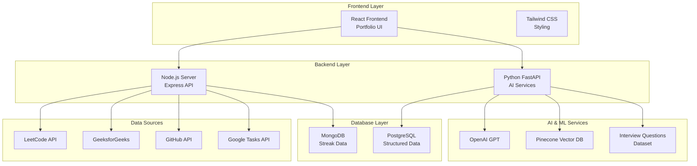
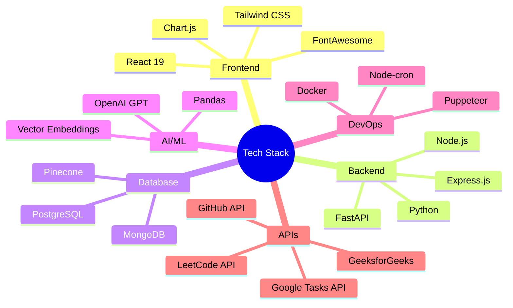

# 🚀 Portfolio Backend Server

A comprehensive full-stack portfolio application with intelligent data aggregation, automated streak tracking, and AI-powered interview preparation features.

## 📋 Table of Contents

- [Overview](#-overview)
- [Architecture](#-architecture)
- [Technology Stack](#-technology-stack)
- [Features](#-features)
- [Project Structure](#-project-structure)
- [Prerequisites](#-prerequisites)
- [Installation & Setup](#-installation--setup)
- [Running the Application](#-running-the-application)
- [API Endpoints](#-api-endpoints)
- [Environment Variables](#-environment-variables)
- [Docker Support](#-docker-support)
- [Contributing](#-contributing)
- [License](#-license)

## 🎯 Overview

This repository contains a sophisticated portfolio backend system that aggregates data from multiple platforms (LeetCode, GeeksforGeeks, GitHub, Google Tasks) to create a comprehensive dashboard with automated streak tracking and AI-powered interview question generation.

### Key Capabilities:
- **📊 Real-time Data Aggregation**: Fetches coding statistics from multiple platforms
- **🔥 Streak Tracking**: Automated daily streak calculation based on coding activity
- **🤖 AI Interview Assistant**: Intelligent question generation using OpenAI and Pinecone
- **📈 Analytics Dashboard**: Visual representation of coding progress and achievements
- **🔐 OAuth Integration**: Secure Google Tasks integration for task management

## 🏗️ Architecture



## 🛠️ Technology Stack



## ✨ Features

### 🎯 Core Features
- **Multi-Platform Data Sync**: Automated data collection from LeetCode, GeeksforGeeks, GitHub, and Google Tasks
- **Intelligent Streak Calculation**: Smart algorithm that tracks daily coding activity across platforms
- **Real-time Dashboard**: Live statistics and progress visualization
- **AI Interview Assistant**: Context-aware interview question generation
- **OAuth Integration**: Secure Google Tasks authentication
- **Automated Scheduling**: Cron-based data synchronization

### 🔧 Technical Features
- **RESTful API Design**: Clean, documented API endpoints
- **Error Handling**: Comprehensive error management and logging
- **Data Validation**: Input validation and sanitization
- **CORS Support**: Cross-origin resource sharing configuration
- **Environment Management**: Secure configuration management

## 📁 Project Structure

```
server-backend/
├── 📁 backend/                    # Node.js Backend
│   ├── 📁 server/                 # Express server
│   │   └── Server.js              # Main server file
│   ├── 📁 utils/                  # Utility functions
│   │   ├── fetchLeetCodeData.js   # LeetCode data fetcher
│   │   ├── fetchGeeksforGeeksData.js # GeeksforGeeks fetcher
│   │   ├── fetchGitHubData.js     # GitHub data fetcher
│   │   └── tasks.js               # Google Tasks integration
│   ├── package.json               # Backend dependencies
│   └── Dockerfile                 # Backend container config
├── 📁 frontend/                   # React Frontend
│   ├── 📁 src/                    # Source code
│   │   ├── 📁 components/        # React components
│   │   │   ├── Dashboard.js       # Analytics dashboard
│   │   │   ├── Chatbot.js         # AI chat interface
│   │   │   └── ...                # Other components
│   │   └── App.js                 # Main app component
│   ├── 📁 public/                 # Static assets
│   └── package.json               # Frontend dependencies
├── 📁 Scripts/                    # Python AI Services
│   ├── main.py                    # FastAPI application
│   ├── jdagent.py                 # Job description agent
│   ├── requirements.txt           # Python dependencies
│   └── interview_questions.csv    # Question dataset
└── README.md                      # This file
```

## 🔧 Prerequisites

Before running this application, ensure you have the following installed:

- **Node.js** (v16 or higher)
- **Python** (v3.8 or higher)
- **MongoDB** (v4.4 or higher)
- **PostgreSQL** (v12 or higher)
- **Git**

### Required API Keys:
- OpenAI API Key
- GitHub Personal Access Token
- Google OAuth Credentials
- Pinecone API Key
- MongoDB Connection String

## 🚀 Installation & Setup

### 1. Clone the Repository
```bash
git clone https://github.com/yourusername/server-backend.git
cd server-backend
```

### 2. Backend Setup (Node.js)
```bash
cd backend
npm install
```

### 3. Frontend Setup (React)
```bash
cd frontend
npm install
```

### 4. Python AI Services Setup
```bash
cd Scripts
pip install -r requirements.txt
```

### 5. Environment Configuration
Create `.env` files in the appropriate directories:

**Backend/.env:**
```env
MONGO_URI=mongodb://localhost:27017/portfolio
GOOGLE_CLIENT_ID=your_google_client_id
GOOGLE_CLIENT_SECRET=your_google_client_secret
REFRESH_TOKEN=your_refresh_token
```

**Scripts/.env:**
```env
OPENAI_API_KEY=your_openai_api_key
PINECONE_API_KEY=your_pinecone_api_key
```

## 🏃‍♂️ Running the Application

### Development Mode

#### 1. Start the Backend Server
```bash
cd backend
npm start
# Server runs on http://localhost:3000
```

#### 2. Start the Frontend
```bash
cd frontend
npm start
# Frontend runs on http://localhost:3001
```

#### 3. Start the AI Services
```bash
cd Scripts
python main.py
# AI API runs on http://localhost:7999
```

### Production Mode

#### Using Docker
```bash
# Build and run backend
cd backend
docker build -t portfolio-backend .
docker run -p 3000:3000 portfolio-backend

# Build and run frontend
cd frontend
npm run build
# Serve the build folder with a web server
```

## 📡 API Endpoints

### Backend API (Port 3000)

| Endpoint | Method | Description |
|----------|--------|-------------|
| `/api/dashboard-data` | GET | Fetch current dashboard data |
| `/api/streak-history` | GET | Get streak history |
| `/api/latest-dashboard-data` | GET | Get latest streak data |
| `/api/update-streak` | POST | Manually update streak |
| `/auth/google` | GET | Google OAuth authentication |
| `/auth/google/callback` | GET | OAuth callback handler |

### AI Services API (Port 7999)

| Endpoint | Method | Description |
|----------|--------|-------------|
| `/api/chat` | POST | Generate interview questions |
| `/api/chatgpt` | POST | ChatGPT-powered responses |
| `/health` | GET | Health check |

### Example API Usage

```javascript
// Fetch dashboard data
const response = await fetch('http://localhost:3000/api/dashboard-data');
const data = await response.json();

// Generate interview questions
const chatResponse = await fetch('http://localhost:7999/api/chat', {
  method: 'POST',
  headers: { 'Content-Type': 'application/json' },
  body: JSON.stringify({
    question: "What are React hooks?",
    job_description: "Frontend Developer position..."
  })
});
```

## 🔐 Environment Variables

### Backend (.env)
```env
# Database
MONGO_URI=mongodb://localhost:27017/portfolio

# Google OAuth
GOOGLE_CLIENT_ID=your_client_id
GOOGLE_CLIENT_SECRET=your_client_secret
REFRESH_TOKEN=your_refresh_token

# GitHub (optional)
GITHUB_TOKEN=your_github_token
```

### AI Services (.env)
```env
# OpenAI
OPENAI_API_KEY=sk-your-openai-key

# Pinecone
PINECONE_API_KEY=your-pinecone-key
PINECONE_ENVIRONMENT=your-environment
```

## 🐳 Docker Support

### Backend Dockerfile
```dockerfile
FROM node:16-alpine
WORKDIR /app
COPY package*.json ./
RUN npm install
COPY . .
EXPOSE 3000
CMD ["npm", "start"]
```

### Running with Docker Compose
```yaml
version: '3.8'
services:
  backend:
    build: ./backend
    ports:
      - "3000:3000"
    environment:
      - MONGO_URI=mongodb://mongo:27017/portfolio
    depends_on:
      - mongo
  
  mongo:
    image: mongo:4.4
    ports:
      - "27017:27017"
```

## 🤝 Contributing

1. Fork the repository
2. Create a feature branch (`git checkout -b feature/amazing-feature`)
3. Commit your changes (`git commit -m 'Add some amazing feature'`)
4. Push to the branch (`git push origin feature/amazing-feature`)
5. Open a Pull Request

### Development Guidelines
- Follow ESLint configuration for JavaScript
- Use Prettier for code formatting
- Write comprehensive tests for new features
- Update documentation for API changes

## 📄 License

This project is licensed under the MIT License - see the [LICENSE](LICENSE) file for details.

## 🆘 Support

If you encounter any issues or have questions:

1. Check the [Issues](https://github.com/yourusername/server-backend/issues) page
2. Create a new issue with detailed information
3. Contact the maintainers

---

<div align="center">

**Made with ❤️ by [Your Name]**

[](https://github.com/yourusername/server-backend)
[](https://github.com/yourusername/server-backend)
[](https://github.com/yourusername/server-backend/issues)

</div>